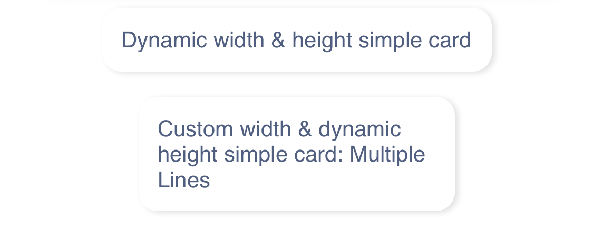

Fully customizable Card View for React Native.

[](https://www.npmjs.com/package/@paraboly/react-native-card)
[](https://www.npmjs.org/package/@paraboly/react-native-card)

[](https://opensource.org/licenses/MIT)

## Card Component

<p align="center">
  
  
</p>

## SimpleCard Component

<p align="center">
  
  
</p>

## Version 1 is here 😍

Finally version 1 is here after 2 years :) Completely re-written with Typescript and much better props and customization options.

## Components included

- [x] [Card](https://github.com/Paraboly/react-native-card#basic-usage)
- [x] [SimpleCard](https://github.com/Paraboly/react-native-card#simplecard-basic-usage)

## Installation

Add the dependency:

```ruby
npm i @paraboly/react-native-card
```

## Peer Dependencies

##### IMPORTANT! You need install them

```bash
"react-native-vector-icons": ">= 7.1.0",
"react-native-dynamic-vector-icons": ">= 1.1.4",
"@freakycoder/react-native-bounceable": ">= 0.2.4"
```

# Expo Version

## Installation

Add the dependency:

```ruby
npm i Paraboly/react-native-card#expo
```

## Expo Dependencies

##### IMPORTANT! You need install them

```bash
"@freakycoder/react-native-bounceable": ">= 0.2.4"
```

`IconType` prop is available to set any icon set from `@expo/vector-icons`

## Basic Usage

```jsx
import { Card } from "@paraboly/react-native-card";

<Card
  iconDisable
  title="Title"
  description="Main Content"
  bottomRightText="30"
  onPress={() => {}}
/>;
```

## Card with Icon

```jsx
<Card
  title="Title"
  iconName="home"
  iconType="Entypo"
  topRightText="50/301"
  bottomRightText="30 km"
  description="Lorem ipsum dolor sit."
  onPress={() => {}}
/>
```

## SimpleCard Basic Usage

```jsx
import { SimpleCard } from "@paraboly/react-native-card";

<SimpleCard title="Dynamic width & height simple card" />;
```

## SimpleCard Custom Usage

```jsx
<SimpleCard
  title="Custom width & dynamic height simple card: Multiple Lines"
  styles={{ width: 200 }}
/>
```

### Example Application

- [check the code](examples/App.js), and yes! :) all of the images, screenshots are directly taken
  from the this example. Of course, you can simply clone the project and run the example on your own environment.

### Configuration - Props

#### New Configuration Documentation is available soon

## Author

FreakyCoder, kurayogun@gmail.com | kuray.ogun@paraboly.com

## License

Paraboly React Native Card Library is available under the MIT license. See the LICENSE file for more info.
